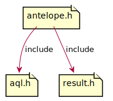

# Antelope

## Antelope
Antelope is a lightweight, relational database management system for resource-constrained IoT devices.

## Documentation
https://github.com/contiki-ng/contiki-ng/wiki/Documentation:-Antelope

## Source Code
https://github.com/contiki-ng/contiki-ng/tree/develop/os/storage/antelope

## API

