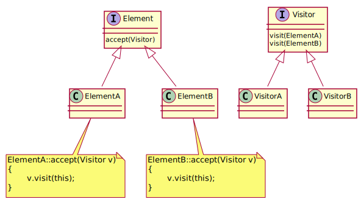
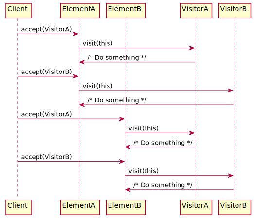

# Visitor Deisgin Pattern

[전체 패턴 보기](../index.md)

## 정의
`Represent an operation to be performed on elements of an object structure. Visitor lets you define a new operation without changing the classes of the elements on which it operates(Gang of Four)`
- Visitor는 객체 구조의 element에 대해 수행할 operation을 나타낸다.
- element 클래스들을 변경 없이 새로운 operation을 정의할 수 있다.
- 객체 구조로부터 알고리즘을 분리하는 방법 중 하나.

## 구조
- Element Interface
- Concrete Elements
- Visitor Interface
- Concrete Visitors

