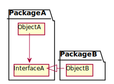

# SOLID

## SRP(Single Responsibility Principle)
- 객체는 하나의 책임만을 맡아야 함
- 변화하는 이유가 1개여야함

## OCP(Open Close Principle)
- 확장에는 열려있고 변경에는 닫혀있어야 함
- 변화하는 것과 변하지 않는 것을 구분한 후 두 모듈이 만나는 지점에 인터페이스를 정의

## LSP(The Liskov Substitution Principle)
- 기반 클래스는 파생 클래스로 대체 가능해야 함
- 파생 클래스가 기반 클래스의 속성을 제한하지 않아야 함
- 인터페이스만 알면 구현체를 몰라도 사용 가능함

## ISP(Interface Segregation Principle)
- 자신이 사용하지 않는 인터페이스는 구현하지 말아야 한다
- 하나의 일반적인 인터페이스보다 구체적인 여러 인터페이스가 나음

## DIP(Dependency Inversion Principle)
- 상위 모듈은 하위 모듈의 구상 클래스가 아닌 추상 클래스에 의존해야 함
- 하위 모듈에 의존하지 않게 하여 상위 모듈이 하위 모듈의 구현으로부터 독립되게 함
- DIP를 적용하기 전에는 A가 B를 의존함
- DIP를 적용한 후에는 B가 A를 의존함
- 의존관계가 역전이 되었기 때문에 Dependency Inversion이라고 하는 것

### Before DIP

### After DIP

